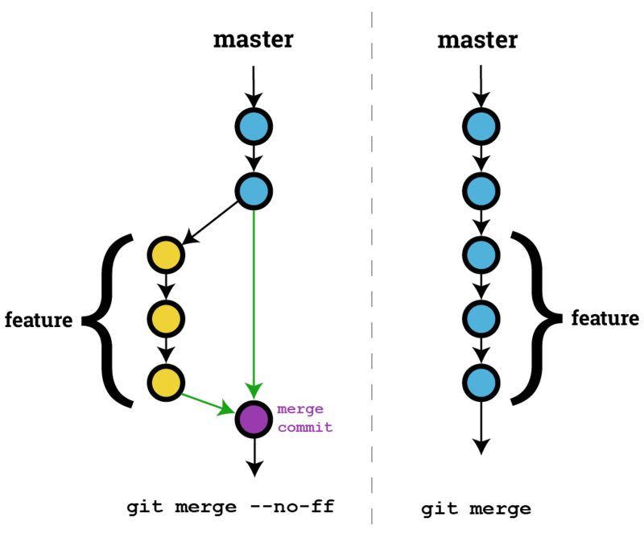

# Git 学习总结

## 仓库的本质(repository)

### 本质: ⼀个所有的历史都可追溯的⽂件夹

- 历史的最⼩单位是仓库在某个时刻的状态（快照）

- 通常⽤ SHA-1 表示

### 那些东西可以标识仓库的某个状态

- **commit 对象的 SHA-1 (无需写全)**

- **分支（branch）**

- **HEAD**

- **标签（tag）**

## 提交的本质(commit)

### 本质: 仓库从一个状态转移到另外的一个状态时发生的变化

### 持续的⼯作和提交，在仓库中建⽴了⼀棵树

### commit 对象是不可变的

#### 那么 `git commit --amend` 是什么

如果提交消息中包含不明确、不正确或敏感的信息，您可以在本地修改它，然后将含有新消息的新提交推送到仓库。 您还可以更改提交消息以添加遗漏的信息。

> 可以使用 `git commit --amend` 命令更改最近的提交消息

但是需要注意的是：

> 在 Git 中，提交消息的文本是提交的一部分。 更改提交消息将更改提交 ID - 即用于命名提交的 SHA1 校验和。 实际上，您是创建一个新提交以替换旧提交。

## 分支的本质(branch)

### 本质: 一个可以移动的指针，指向某个提交对象

- 新建一个分支，就是新建一个指针

- git checkout -b new-branch-name {仓库的某个状态}

### 特殊的指针 HEAD(头指针)

HEAD 是一个指针，指向某一个分支，通常你可以把 HEAD 当做`当前所在分支`看待。

> HEAD 通常会指向当前所在分支。不过 HEAD 也不一定总是会指向某个分支，当 HEAD 没有指向某个分支的时候便会造成 `detached HEAD` 的状态，指向的是 commit。

#### HEAD 的 `~` 和 `^` 的使用

- `~` 表示获取第一个祖先提交，`~<n>`，相当于连续的 `n 个 ^`

  > 如 `~2` 相当于 `^^`。

- `^` 表示获取第一个父提交，当一个提交有多个父提交时，可以通过在 `^` 后面加多一个数字，表示是第几个父提交。

  > 如 `HEAD^^^` 相当于 `HEAD^1^1^1`，并不等价于 `HEAD^3`。

  `^` 的作用

  ```shell
  * f44239d D
  *   7a3fb3d C
  |\
  | * 07b920c B
  |/
  * 71bd2cf A
  ```

  很多情况下一个提交并不是只有一个父提交。 就如上图表示那样，`7a3fb3d (C)` 就有两个父提交：

  - `07b920c (B)`

  - `71bd2cf (A)`

  这时候，我们是不能通过 `~` 去找到 `07b920c (B)` 这个提交的。 如果一个提交有多个父提交，那么 `~` 只会找第一个父提交。
  那么我们应该怎么找到 `07b920c (B)` 呢？ 答案是：`HEAD~^2`

#### 额外

> `checkout` 只会移动 `HEAD 指针`, `reset` 会改变 `HEAD 指针` 的引用值

#### 引用 kernel.org 中非常形象的一段话

> Here is an illustration, by Jon Loeliger. Both commit nodes B and C are parents of commit node A. Parent commits are ordered left-to-right.
> 这是 Jon Loeliger 的插图。提交节点 B 和 C 都是提交节点 A 的父节点。父提交的顺序是从左到右。

```shell
G   H   I   J
 \ /     \ /
  D   E   F
   \  |  / \
    \ | /   |
     \|/    |
      B     C
       \   /
        \ /
         A
A =      = A^0
B = A^   = A^1     = A~1
C = A^2  = A^2
D = A^^  = A^1^1   = A~2
E = B^2  = A^^2
F = B^3  = A^^3
G = A^^^ = A^1^1^1 = A~3
H = D^2  = B^^2    = A^^^2  = A~2^2
I = F^   = B^3^    = A^^3^
J = F^2  = B^3^2   = A^^3^2
```

## 推送(`push`)本地仓库分支到远程仓库分支

### 本地分支能 `push` 到远程分支的前提是

> 远程分支的 `最新一次 commit` 必须是本地分支的 `父 commit`

## `Fast-Forward` 快进模式合并

**如果 `当前分支` 的位置（HEAD）是某个要 `被 merge 的分支` 上的 `commit` 的 `父提交（root commit）`，并且 `当前分支没有任何新的 commit` 的情况下， 要进行 merge 回来时，就会自动触发 `fast-forward`。**

**因为在原本分支上没有 `新的 commit` 需要被 `merge`，所以自动就会触发 fast-forward merge，就会直接把这个 commit `HEAD 指针` 移动指向到要 `被 merge 的 commit` 的位置上，同时也 `不会新增` 一个 `merge commit`。**

> `Fast-Forward` 快进模式合并，在分支上的版本历史是一条直线

### 我们也可以在 `Merge` 的时候 `不要 fast-forward`

**Git 的 `merge 命令` 有一个参数 `--no-ff` ，这个参数是告诉 git 知道，我们这次 merge 是不需要进行 fast-forward 快进模型合并的。**

### `Fast-Forward` 和 `Non-Fast-Forward` 的区别



### 加上 `--no-ff` 的优缺点

- **优点：**

  在开发一个功能时，通常会开一个新的 feature 分支，使用 `--no-ff` 参数可以让团队成员在日后很清楚辨识出不同的功能所包含的 commit 历史有哪些

  > 额外，GitHub 的 merge `pull request` 的策略也是使用 `--no-ff`

- **缺点：**

  若这个任务或者 bug-fix 只有 `一个 commit`，很容易造成一堆 `小耳朵` 的存在

## 命令 `git fetch` 和 `git pull`

### 命令 `git fetch`

**假设远程仓库叫做 `origin` ，当我们执行 `git fetch` 命令时，Git 会比较本地仓库和远程仓库的差别，会 「下载远程仓库 `origin` 上有但本地目前没有」的内容下来，并且会在本地仓库生成相应的分支。**

> `fetch` 命令只会下载，并不会进行合并操作。

### 命令 `git pull`

**`pull` 指令其实做的事情跟 `fetch` 是一样的，差别只在于 `fetch` 只有把档案抓下来，但 `pull` 不只抓下来，还会顺便进行合并。**

> 本质上， `git pull` 其实就等于 `git fetch` 加上 `merge` 指令

### 命令 `git pull --rebase`

> 本质上， `git pull` 其实就等于 `git fetch` 加上 `rebase` 指令

## `git checkout SHA1`, `git reset SHA1` 和 `git revert SHA1` 这三个指令的区别

### git checkout SHA1

**这个指令会把目前的 `HEAD` 移到指定的 commit 上，并且把目前的状态变成那个 commit 时候的样子，但是不会移动任何分支（也就是分支都停在原来的地方，只有 `HEAD` 移动而已）。**

**因此，整个历史纪录看起来并没有什么变化，只是 `HEAD` 暂时移到某个地方而已。**

### git reset SHA1

**这个指令会把目前的 `HEAD` 跟分支都一起移到指定的 commit 上，同时会根据后面追加的参数（常见的有 `--mixed`、 `--soft` 跟 `--hard`），会决定原本那些 commit 的文件和工作区的文件去留。**

- **使用预设的 `--mixed` 会把文件留在 `工作目录`，但不会留在 `暂存区`。**
- **使用 `--soft` 会把文件留在 `工作目录` 和 `暂存区` ，所以看起来就只有 `HEAD` 的移动而已。也因此，Commit 拆出来的文件会直接放在暂存区。**
- **使用 `--hard` 则会把抛弃这些变化。**

**而不管是哪个参数，不只是 `HEAD` 的位置变了，整个历史纪录看起来也会有变化（变短或变长都有可能）。**

### git revert SHA1

**这个指令会产生一个新的 commit，而这个 commit 的目的就是去取消（或该说是 undo）某些 commit 做的事情。**

**因为本质上还是 commit，所以整个 Git 的历史纪录不会变短，只会越 revert 越长。**

## `git reset --soft` 模式

### 已 `commit` 的文件会保留到 `暂存区` 上去

### 原本已在 `暂存区` 的文件不会发生改变

### `工作区` 的文件不会发生改变

```shell
git status
On branch fix/readme
Your branch is ahead of 'zhineng/fix/readme' by 1 commit.
  (use "git push" to publish your local commits)

Changes to be committed:
  (use "git reset HEAD <file>..." to unstage)

  new file:   B.java

Changes not staged for commit:
  (use "git add <file>..." to update what will be committed)
  (use "git checkout -- <file>..." to discard changes in working directory)

  modified:   index.html

Untracked files:
  (use "git add <file>..." to include in what will be committed)

  C.java

git reset --soft d436f9d

git status
On branch fix/readme
Your branch is up to date with 'zhineng/fix/readme'.

Changes to be committed:
  (use "git reset HEAD <file>..." to unstage)

  new file:   A.java
  new file:   B.java

Changes not staged for commit:
  (use "git add <file>..." to update what will be committed)
  (use "git checkout -- <file>..." to discard changes in working directory)

  modified:   index.html

Untracked files:
  (use "git add <file>..." to include in what will be committed)

  C.java
```

## `git reset --mixed` 模式（默认模式）

### 已 `commit` 的文件会保留到 `工作区` 上去

### 原本已在 `暂存区` 的文件会保留到 `工作区` 上去

### `工作区` 的文件不会发生改变

```shell
git status
On branch fix/readme
Your branch is ahead of 'zhineng/fix/readme' by 1 commit.
(use "git push" to publish your local commits)

Changes to be committed:
(use "git reset HEAD <file>..." to unstage)

new file: B.java

Changes not staged for commit:
(use "git add <file>..." to update what will be committed)
(use "git checkout -- <file>..." to discard changes in working directory)

modified: index.html

Untracked files:
(use "git add <file>..." to include in what will be committed)

C.java

git reset HEAD^

git status
On branch fix/readme
Your branch is up to date with 'zhineng/fix/readme'.

Changes not staged for commit:
(use "git add <file>..." to update what will be committed)
(use "git checkout -- <file>..." to discard changes in working directory)

modified: index.html

Untracked files:
(use "git add <file>..." to include in what will be committed)

A.java
B.java
C.java

no changes added to commit (use "git add" and/or "git commit -a")
```

## `git reset --hard` 模式

### 已 `commit` 的文件会丢弃掉

### 原本已在 `暂存区` 的文件会丢弃掉

### `工作区` 的文件会丢弃掉，但未追踪的文件还会保留

```shell
git status
On branch fix/readme
Your branch is ahead of 'zhineng/fix/readme' by 1 commit.
  (use "git push" to publish your local commits)

Changes to be committed:
  (use "git reset HEAD <file>..." to unstage)

  new file:   B.java

Changes not staged for commit:
  (use "git add <file>..." to update what will be committed)
  (use "git checkout -- <file>..." to discard changes in working directory)

  modified:   index.html

Untracked files:
  (use "git add <file>..." to include in what will be committed)

  C.java

git reset --hard HEAD^

git status
On branch fix/readme
Your branch is up to date with 'zhineng/fix/readme'.

Untracked files:
  (use "git add <file>..." to include in what will be committed)

  C.java
```

## 取消 `rebase` 命令

### 使用 `git reflog` + `git reset --hard <rebase 之前的 commit>`

### 使用 `git reset --hard ORIG_HEAD`

> 在 Git 有另一个特别的纪录点叫做 `ORIG_HEAD`，这个 `ORIG_HEAD` 会记录「危险操作」之前 `HEAD` 的位置。例如 `分支合并` 或是 `reset` 之类的都算是所谓的「危险操作」。

## 使用 rebase 注意事项

### 小结

**使用 Rebase 来合并分支的好处，就是它不像一般合併可能会产生额外的合并专用的 Commit，而且历史顺序可以依照谁 Rebase 谁而决定；**

**但缺点就是它相对的比一般的合并来得没那么直觉，一个不小心可能会弄坏掉而且还不知道怎么 `Reset` 回来，或是发生冲突的时候就会停在一半，对不熟悉 Rebase 的人来说是个困扰。**

### 一般使用在的地方

**通常在 `还没有推送（Push）` 出去但感觉得有点乱（或太琐碎）的 Commit，我会先使用 Rebase 分支来整理完再推出去。**

**但如同前面提到的，Rebase 等于是修改历史，修改已经推出去的历史可能会对其它人带来困扰，所以对于已经推出去的内容，非必要的话请尽量不要使用 Rebase。**

## 参考资料

- [https://xiedaimala.com](https://xiedaimala.com/)
- [https://scarletsky.github.io/2016/12/29/tilde-and-caret-in-git/](https://scarletsky.github.io/2016/12/29/tilde-and-caret-in-git/)
- [https://qiita.com/vc7/items/6e06b0306c8a64a23263](https://qiita.com/vc7/items/6e06b0306c8a64a23263)
- [https://gitbook.tw/interview](https://gitbook.tw/interview)
