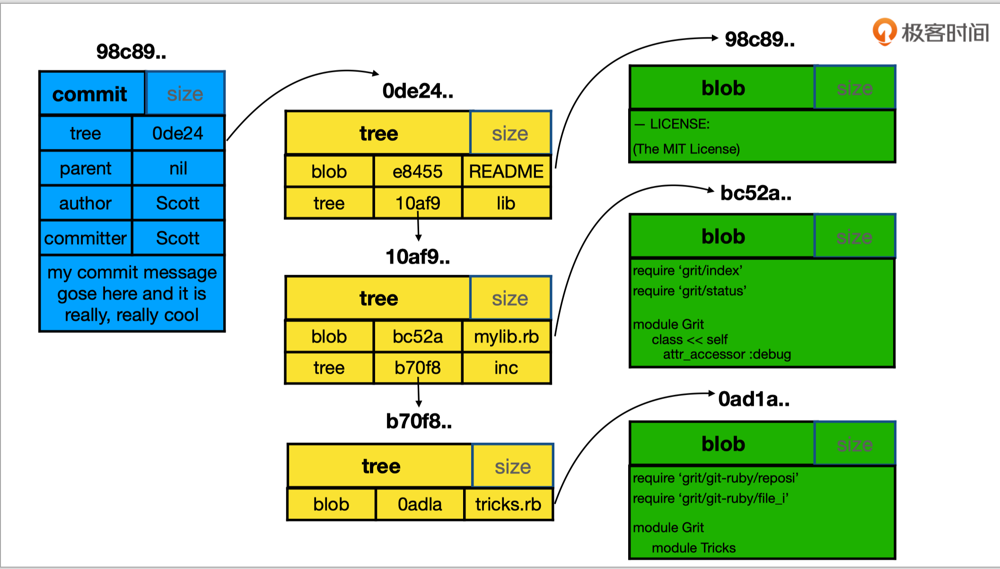
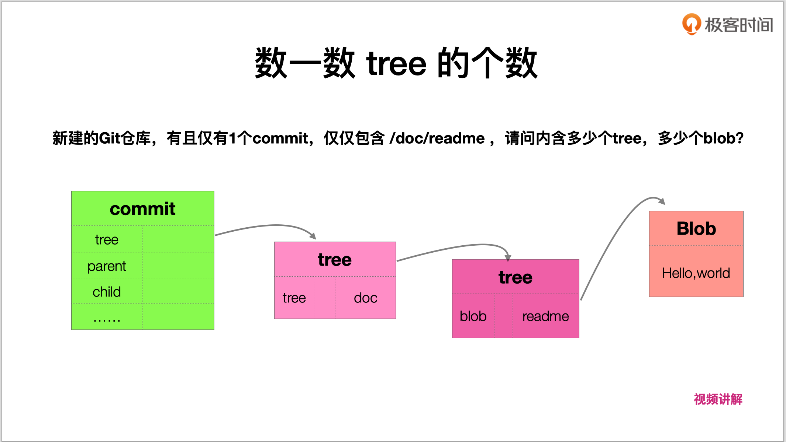
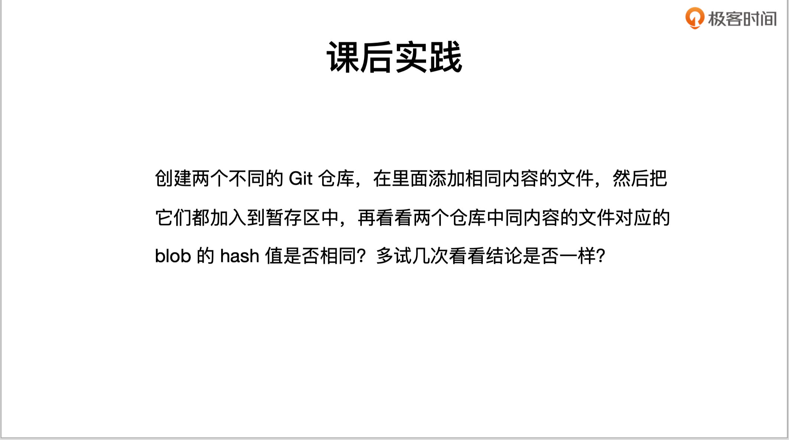

# commit, tree, blob 三个对象之间的关系

## 关系图



> **blob 与文件名没有关系，只与文件内容有关系
> 若文件内容相同，则认为是同一个 blog**

```shell
# 查看 git commit hash 值
$ git log --oneline --all --graph

# 查看 commit
$ git cat-file -p a21b9c8
tree 53dd1d29fdb68ba8472a133324e2deb67bad7134
parent aa25316566733188cc5e2541db655b2af2cccd75
author monsterhxw <770342643@qq.com> 1586127424 +0800
committer monsterhxw <770342643@qq.com> 1586127424 +0800

add style.css

# 查看 tree
$ git cat-file -p 53dd1d29fdb68ba8472a133324e2deb67bad7134
100644 blob e69de29bb2d1d6434b8b29ae775ad8c2e48c5391 README.md
040000 tree d856c7427d950f8b5876f94947a6945a142e7504 images
100644 blob e69de29bb2d1d6434b8b29ae775ad8c2e48c5391 index.html
040000 tree 8123a484e48e5b63593bf0a80bc68b394d28e64a styles

# 查看 blob
$ git cat-file -p e69de29bb2d1d6434b8b29ae775ad8c2e48c5391
```

## 文件结构

```shell
commit
├── tree
│   └── blob
│   └── tree
│   │   └── blob
│   └── blob
│   └── tree
│       └── blob
├── parent
├── author
└── committer
```

## 练习：数一数 tree 的个数



### 答：2 个 tree，1 个 blob

## 练习：课后实践



### 答：不同 Git 仓库，在里面有相同内容的文件，这两个文件对应的 blob 的 hash 值是相同的

```shell
$ find watch_git_objects_practice_1/.git/objects -type f
watch_git_objects_practice_1/.git/objects/e0/f1ee1826f922f041e557a16173f2a93835825e

$ find watch_git_objects_practice_2/.git/objects -type f
watch_git_objects_practice_2/.git/objects/e0/f1ee1826f922f041e557a16173f2a93835825e
```
