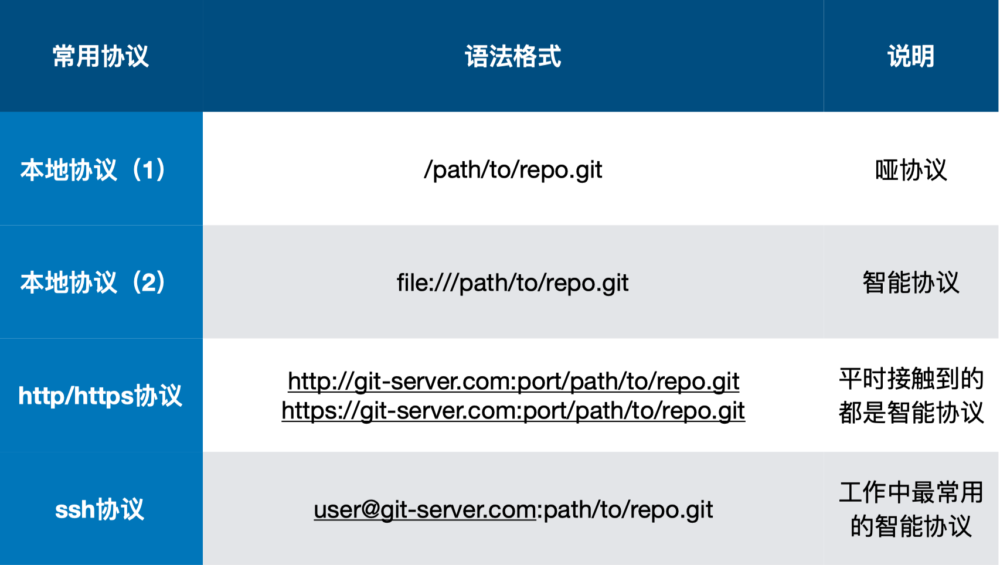
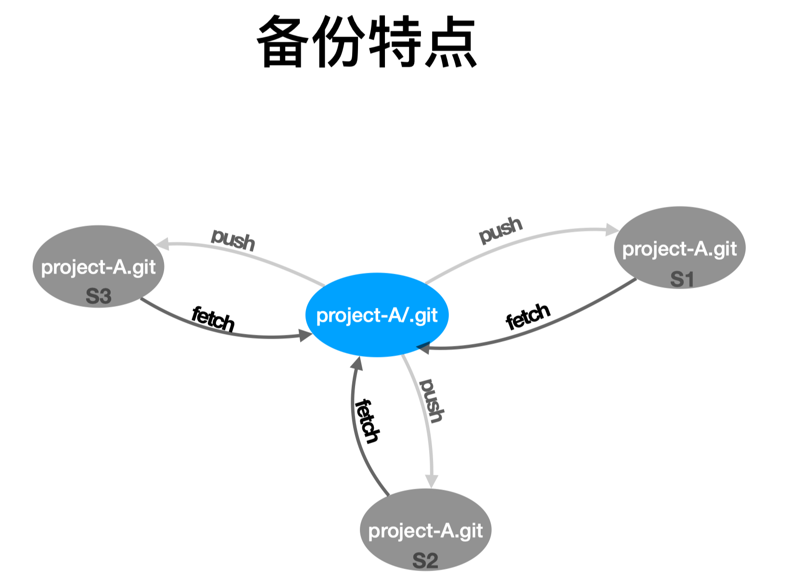

# 如何将 Git 仓库备份到本地

## 常用的传输协议



### 哑协议与智能协议

- **直观区别：哑协议传输进度不可⻅见；智能协议传输可⻅见。**
- **传输速度：智能协议⽐哑协议传输速度快。**

## 备份特点



## 使用哑协议备份

```shell
git clone --bare /Users/monstervivi/Downloads/Learning/play-with-git/git-learning/.git ya.git
Cloning into bare repository 'ya.git'...
done.

ls -al
total 0
drwxr-xr-x  11 monstervivi  staff   352B  4  9 12:36 ya.git
```

## 使用智能协议备份

```shell
git clone --bare file:///Users/monstervivi/Downloads/Learning/play-with-git/git-learning/.git zhineng.git
Cloning into bare repository 'zhineng.git'...
remote: Enumerating objects: 16, done.
remote: Counting objects: 100% (16/16), done.
remote: Compressing objects: 100% (8/8), done.
remote: Total 16 (delta 0), reused 0 (delta 0)
Receiving objects: 100% (16/16), done.

ls -al
total 0
drwxr-xr-x   4 monstervivi  staff  128  4  9 12:37 .
drwxr-xr-x   8 monstervivi  staff  256  4  9 12:35 ..
drwxr-xr-x  11 monstervivi  staff  352  4  9 12:36 ya.git
drwxr-xr-x  11 monstervivi  staff  352  4  9 12:37 zhineng.git
```

## 为本地仓库添加远程仓库(remote repository)

### 使用 `git remote add <remote name> <remote url>`

```shell
git remote add zhineng file:///Users/monstervivi/Downloads/Learning/play-with-git/backup/zhineng.git

git branch -av
* fix/readme d436f9d fix/readme
    master     15f3041 add the first git command with config

git push zhineng
fatal: The current branch fix/readme has no upstream branch.
To push the current branch and set the remote as upstream, use

    git push --set-upstream zhineng fix/readme

git push --set-upstream zhineng fix/readme
Branch 'fix/readme' set up to track remote branch 'fix/readme' from 'zhineng'.
Everything up-to-date

git branch -avr
zhineng/fix/readme d436f9d fix/readme
```
