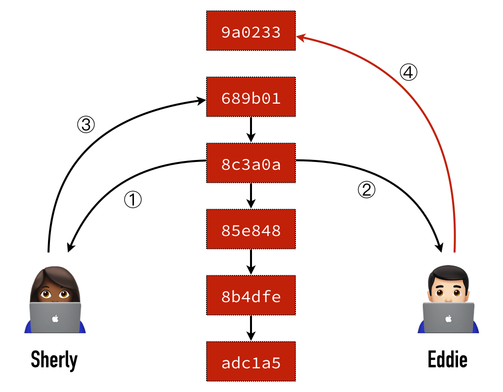

# 如何处理不同人修改了不同文件

## 怎么有时候我们推送（ `push` ）分支会失败

### 有时我们在执行 `git push` 命令的时候出现下面的错误信息

```shell
$ git push
To https://github.com/monsterhxw/dummy-git.git
    ! [rejected]        master -> master (fetch first)
error: failed to push some refs to 'https://github.com/monsterhxw/dummy-git.git'
hint: Updates were rejected because the remote contains work that you do
hint: not have locally. This is usually caused by another repository pushing
hint: to the same ref. You may want to first integrate the remote changes
hint: (e.g., 'git pull ...') before pushing again.
hint: See the 'Note about fast-forwards' in 'git push --help' for details.
```

这里的错误信息指的是，远程仓库的内容比我们本地分支的内容要新，所以 Git 不让我们推上去。

## 造成的原因

### 一般这种情况出现在多人在单分支协作的时候出现



1. Sherly 跟 Eddie 两个人在差不多的时间都从 Git Server 上拉了一份资料下来准备进行开发。
2. Sherly 手脚比较快，先完成了，于是先把做好的成果推一份上去。
3. Eddie 不久后也完成了，但当他要推上去的时候发现推不上去了…

## 解决办法

> 因为本地仓库的内容是比较旧的，所以我们先拉取远程仓库的回来更新，任何再推送（ `push` ）

### 使用 `git fetch` + `git merge <remote/branch>` + `git push <remote>`

### 使用 `git pull` + `git push <remote>`

> 因为 `git pull` 本质等于 `git fetch` + `git merge <remote/branch>`

### 使用 `git pull --rebase` + `git push <remote>`

```shell
$ git pull --rebase
remote: Counting objects: 3, done.
remote: Compressing objects: 100% (2/2), done.
remote: Total 3 (delta 1), reused 3 (delta 1), pack-reused 0
Unpacking objects: 100% (3/3), done.
From https://github.com/monsterhxw/dummy-git
    37aaef6..bab4d89  master     -> origin/master
First, rewinding head to replay your work on top of it...
Applying: update index
```

> `--rebase` 参数是表示「内容抓下来之后请使用 `rebase` 方式合并」，当然你想用一般的合并方式也没问题。合并如果没发生冲突，接着应该就可以顺利往上推送（ `push` ）了。

## 参考资料

- [https://gitbook.tw/chapters/github/fail-to-push.html](https://gitbook.tw/chapters/github/fail-to-push.html)
