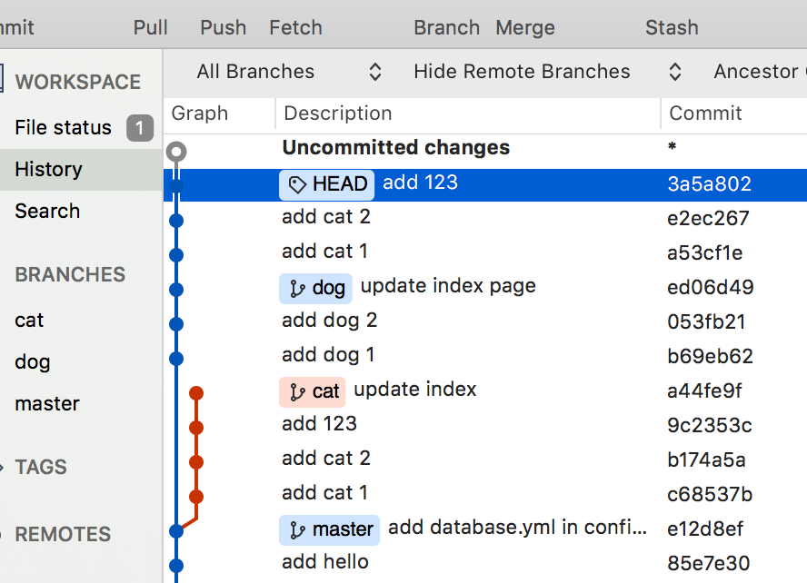

# 如何解决不同人修改了同一文件的同一区域

> 当不同人修改了同一文件的同一区域，其中一人已经先 `push` ，另外的一个人修改完文件之后进行 `push` ，这时候会出现合并冲突（ `conflict` ）。

```shell
git merge dog
Auto-merging index.html
CONFLICT (content): Merge conflict in index.html
Automatic merge failed; fix conflicts and then commit the result.

git status
On branch cat
You have unmerged paths.
    (fix conflicts and run "git commit")
    (use "git merge --abort" to abort the merge)s

Changes to be committed:

    new file:   dog1.html
    new file:   dog2.html

Unmerged paths:
    (use "git add <file>..." to mark resolution)

both modified:   index.html
```

1. 对  `cat`  分支来说，`dog1.html`  跟  `dog2.html`  是新來的档案，但已被放置至暂存区。
2. 但是  `index.html`  这个档案因为两边都修改到了，所以 Git 把它标记成「both modified」状态。

## 解决合并冲突( `Merge Conflict` ) 的办法

### 1. 打开发生冲突的文件，看看发生冲突的地方

```html
<!DOCTYPE html>
<html>
  <head>
    <meta charset="utf-8" />
    <title>首页</title>
  </head>
  <body>
    <div class="container">
      <<<<<<< HEAD
      <div>我是 Cat</div>
      =======
      <div>我是 Dog</div>
      >>>>>>> dog
    </div>
  </body>
</html>
```

**Git 把有冲突的段落标记出來了，上半部是 `HEAD`，也就是目前所在的 `cat` 分支，中间是 `分割线`，接下是 `dog` 分支的内容。**

### 2. 这时候我们需要把修改文件的两个人找过来讨论，到底是该用谁写的代码

如这里我们经过一番讨论之后，决定还是要采纳 `cat` 分支的内容，这时候我们把标记去掉，最后的内容如下：

```html
<!DOCTYPE html>
<html>
  <head>
    <meta charset="utf-8" />
    <title>首页</title>
  </head>
  <body>
    <div class="container">
      <div>我是 Cat</div>
    </div>
  </body>
</html>
```

### 3. 修改完文件之后，把该文件添加到暂存区中，并进行 commit

```shell
git add index.html

git commit -m "conflict fixed'
[cat a28a93c] conflict fixed
```

### 4. 然后 `push` 到远程分支上

```shell
git push <remote>
```

## 使用 rebase 的合并造成冲突的解决办法

> 无论是一般的 `merge` 还是 `rebase`，都会有可能造成合并冲突。

### `rebase` 发生冲突与一般的 `merge` 不太一样

例如

```shell
git rebase dog
First, rewinding head to replay your work on top of it...
Applying: add cat 1
Applying: add cat 2
Applying: add 123
Applying: update index
Using index info to reconstruct a base tree...
M	index.html
Falling back to patching base and 3-way merge...
Auto-merging index.html
CONFLICT (content): Merge conflict in index.html
error: Failed to merge in the changes.
Patch failed at 0004 update index
The copy of the patch that failed is found in: .git/rebase-apply/patch

When you have resolved this problem, run "git rebase --continue".
If you prefer to skip this patch, run "git rebase --skip" instead.
To check out the original branch and stop rebasing, run "git rebase --abort".
```

这时候其实是卡在一半，我们从 SourceTree 中可以看的更清楚



`HEAD` 现在并没有指着任何一个分支，它现在有点像是在修改历史的时候卡在某个时空缝隙里了（其实是 `3a5a802` 这个 Commit）。

看一下目前的状态：

```shell
git status
rebase in progress; onto ed06d49
You are currently rebasing branch 'cat' on 'ed06d49'.
    (fix conflicts and then run "git rebase --continue")
    (use "git rebase --skip" to skip this patch)
    (use "git rebase --abort" to check out the original branch)

Unmerged paths:
    (use "git reset HEAD <file>..." to unstage)
    (use "git add <file>..." to mark resolution)

    both modified:   index.html

no changes added to commit (use "git add" and/or "git commit -a")
```

信息写着 `rebase in progress`，而且那个 `index.html` 的确也是被标记成「both modified」状态。

跟上面提到的方法一样，把 `index.html` 有冲突的内容修正完成后，把它加回暂存区：

```shell
git add index.html
```

接着继续完成刚刚中断的 `rebase`：

```shell
git rebase --continue
Applying: update index
```

## 不是文字文件发生合并冲突

> 上面的 `index.html` 因为是文字文件，所以 Git 可以标记出发生冲突的地方在哪里，我们可以通过肉眼看得出来大概如何去解决，但如果是像图片文件之类但二进制的文件该怎么解决冲突？

例如在 `cat` 分支跟 `dog` 分支，同时都加了一张叫做 `cute_animal.jpg` 的图片，合并的时候出显冲突的信息：

```shell
git merge dog
warning: Cannot merge binary files: cute_animal.jpg (HEAD vs. dog)
Auto-merging cute_animal.jpg
CONFLICT (add/add): Merge conflict in cute_animal.jpg
Automatic merge failed; fix conflicts and then commit the result.
```

这时候我们需要将两边的人请过来一起讨论那张图片才是最可爱的动物。在这时，我们讨论决定猫才是世界上最可爱的动物，所以决定采用 `cat` 分支的图片文件。

```shell
git checkout --ours cute_animal.jpg
```

但如果是觉得对方（ `dog` 分支），则是使用 `--theirs` 参数

```shell
git checkout --theirs cute_animal.jpg
```

在决定之后，和前面的一样，将文件加到暂存区，并且 commit

```shell
git add cute_animal.jpg

git commit -m "conflict fixed'
```
